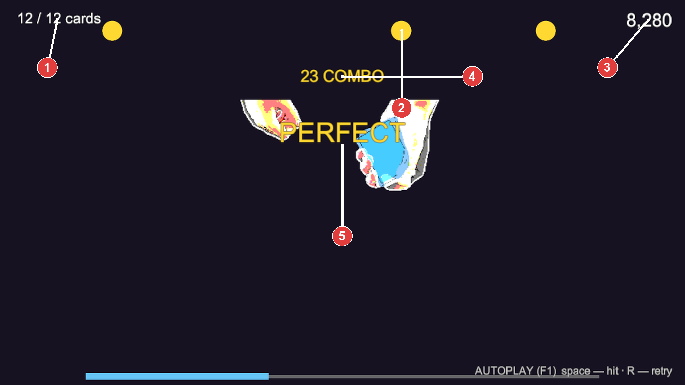
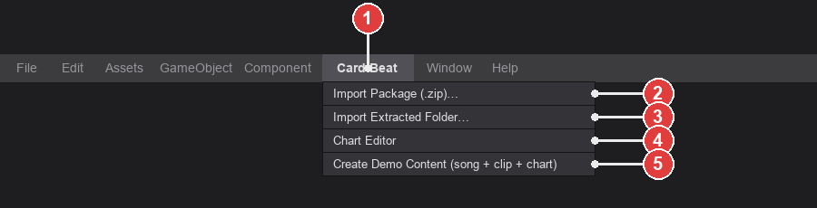
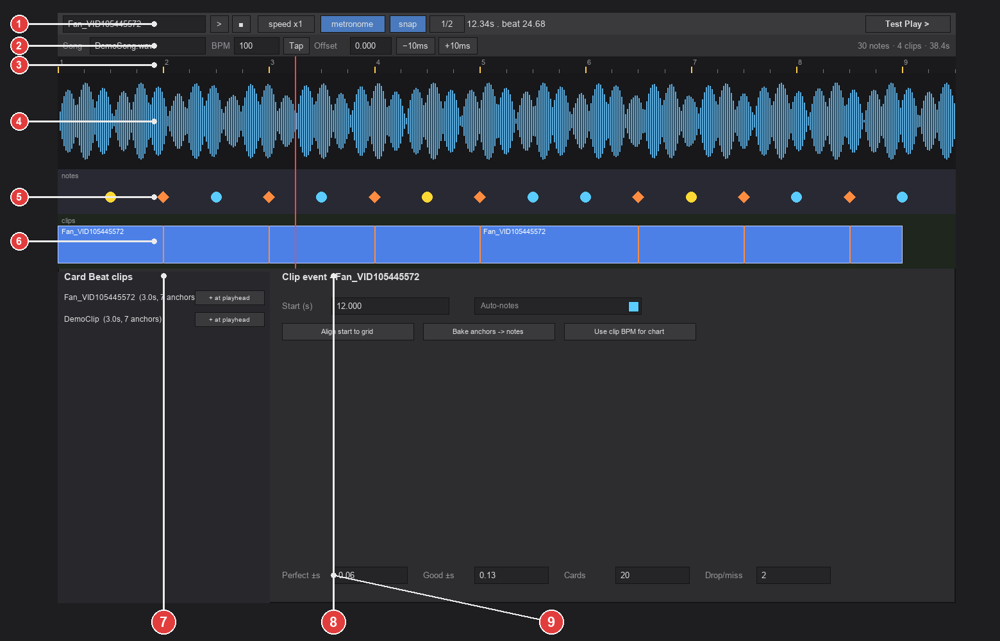
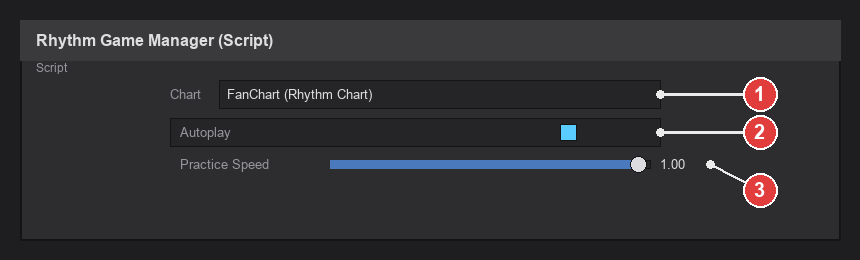
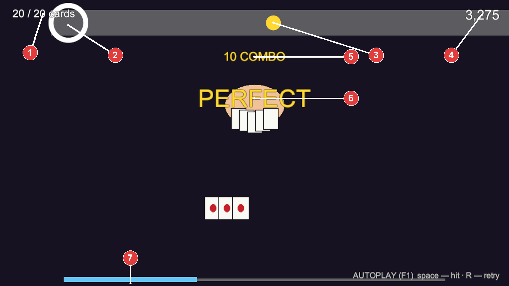
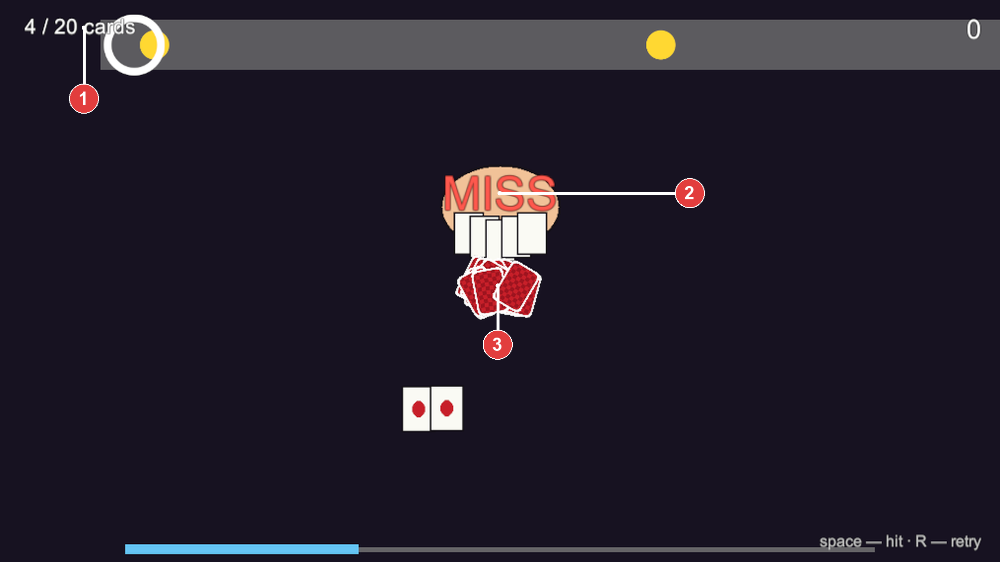
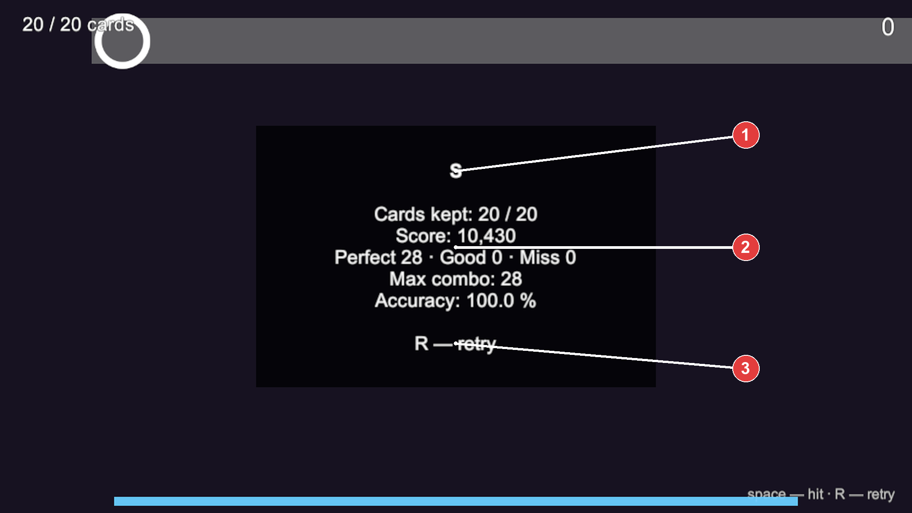

# Card Beat — Unity Rhythm Game

This is the Unity side of **Card Beat**: a PaRappa-the-Rapper-style, single-button rhythm game
built around real card sleight-of-hand footage (deals, fans, table fans, springs, false
shuffles). It plays back clips produced by the [Card Beat web/desktop editor](../README.md)
(crop → toon shader → beat-align → export), lets you place hit notes on a song timeline in a
custom **Chart Editor**, and judges the player's taps against those notes in real time.



This tutorial walks through the whole pipeline: importing a clip, building a chart, and
playing it — using only the Unity Editor (no code required for day‑to‑day use).

---

## Contents

1. [Requirements](#1-requirements)
2. [The 60-second demo](#2-the-60-second-demo)
3. [The pipeline, in one picture](#3-the-pipeline-in-one-picture)
4. [Step 1 — Export a clip from Card Beat](#step-1--export-a-clip-from-card-beat)
5. [Step 2 — Import the package into Unity](#step-2--import-the-package-into-unity)
6. [Step 3 — Create a Rhythm Chart](#step-3--create-a-rhythm-chart)
7. [Step 4 — The Chart Editor, region by region](#step-4--the-chart-editor-region-by-region)
8. [Step 5 — Set up the song](#step-5--set-up-the-song)
9. [Step 6 — Place a clip and understand notes](#step-6--place-a-clip-and-understand-notes)
10. [Step 7 — Tune judgement windows & card rules](#step-7--tune-judgement-windows--card-rules)
11. [Step 8 — Test Play](#step-8--test-play)
12. [Step 9 — Setting up the scene by hand](#step-9--setting-up-the-scene-by-hand)
13. [Step 10 — Playing the game](#step-10--playing-the-game)
14. [Troubleshooting](#troubleshooting)
15. [Reference](#reference)

---

## 1. Requirements

- **Unity 6000.x** (built and tested on 6000.5.2f1), URP 2D template.
- Packages already installed in this project: **Input System**, **uGUI**. Nothing else to add.
- A clip exported from the Card Beat web/desktop editor (`<clip>_cardbeat.zip`, or its
  extracted folder) — or use the built-in demo content if you don't have one yet.

## 2. The 60-second demo

Before touching your own footage, see the whole loop work with generated placeholder content:

1. In Unity: **Card Beat ▸ Create Demo Content (song + clip + chart)**.
2. This synthesizes a fake card-dealing clip, runs it through the real importer, bakes a
   procedural backing track, builds a demo chart, and opens the Chart Editor for you.
3. Press **Play** in the Unity Editor. Hit **Space** on the beat. Press **R** to retry.

If that works, everything below is the same workflow applied to your own exported clip.

## 3. The pipeline, in one picture

```
Card Beat editor (browser/desktop)          Unity
──────────────────────────────────          ─────────────────────────────────────────
crop → key → toon shader → beat anchors     Card Beat ▸ Import Package (.zip)…
        │                                            │
        ▼                                            ▼
 <clip>_cardbeat.zip  ───────────────────►  CardBeatClipAsset (sprites + beat times)
                                                      │
                                                      ▼
                                             Rhythm Chart asset (song + notes + rules)
                                                      │
                                                      ▼
                                             Chart Editor  (place clips, edit notes)
                                                      │
                                                      ▼
                                             RhythmGameManager  (Play ▸ hit the beat)
```

---

## Step 1 — Export a clip from Card Beat

Use the companion web/desktop editor to crop, background-key, toon-shade, and beat-align your
footage, then export. This produces a `<clip>_cardbeat.zip` containing:

```
frames/frame_0000.png …     — the composited, beat-retimed RGBA frame sequence
masks/hand/frame_0000.png … — optional per-object masks (one folder per SAM-tracked object)
masks/playing_card/…
cardbeat.json                — timing metadata (beat times, anchors, layer info)
```

See the main project README (one folder up) for the editor itself. Everything below assumes
you already have this zip (or its extracted folder).

## Step 2 — Import the package into Unity

Open the **Card Beat** menu in Unity's menu bar:



1. **Card Beat** — the menu itself; everything for this pipeline lives under it.
2. **Import Package (.zip)…** — pick the `.zip` Card Beat exported directly. Fastest option.
3. **Import Extracted Folder…** — if you already unzipped it, pick that folder instead
   (must contain `cardbeat.json`).
4. **Chart Editor** — opens the rhythm-game chart editor (Step 4 below).
5. **Create Demo Content** — the one-click demo from [Step 2 above](#2-the-60-second-demo).

Pick option **2** or **3** and select your clip. The importer will:

- Copy `frames/` and every `masks/<name>/` folder into `Assets/CardBeatClips/<clip name>/`,
  with correct sprite import settings applied automatically (RGBA, uncompressed, no mips).
- Parse `cardbeat.json` and create a **`CardBeatClipAsset`** in that same folder — this is the
  single object you'll reference everywhere else. It holds the frame sprites, the fps, every
  beat time (`beatsSec`), which of those are anchors (`beatsAccent`), and any mask layers.
- Log a one-line summary to the Console (frame count, fps, anchor count, mask layer count) —
  check there first if something seems off.

> **No beat anchors?** If you didn't drop anchors in the Card Beat editor before exporting,
> `beatsSec` will be empty. The clip still imports fine — you'll just add notes by hand in the
> Chart Editor instead of relying on auto-generated ones (see Step 6).

## Step 3 — Create a Rhythm Chart

A **Rhythm Chart** is the playable unit: a song, a beat grid, one or more clips placed on that
song's timeline, and the notes the player has to hit.

**Assets ▸ Create ▸ Card Beat ▸ Rhythm Chart** — name it and drag your song (any `AudioClip`)
onto its **Song** field in the Inspector, or leave it and set the song from inside the Chart
Editor in the next step.

## Step 4 — The Chart Editor, region by region

**Card Beat ▸ Chart Editor.** This is the whole authoring surface — one window, no code.



| # | Region | What it does |
|---|--------|---------------|
| 1 | **Toolbar** | Pick the chart asset; transport (▶/■); practice **speed**; **metronome** toggle; **snap** toggle + division (1/1…1/8); live playhead readout; **Test Play** button. |
| 2 | **Song row** | Song `AudioClip`, **BPM**, **Tap** (tap-tempo — click ≥3 times on the beat), **Offset** (nudge the whole grid ±10 ms), and a live summary (note/clip/duration counts). |
| 3 | **Ruler & beat grid** | Bar numbers and second ticks. Vertical gold lines mark bars, faint lines mark beats/subdivisions — this grid is what note/clip dragging snaps to. |
| 4 | **Waveform** | Your song's audio, so you can eyeball where hits actually land. |
| 5 | **Note lane** | Orange **diamonds** = notes auto-derived from a clip's beat anchors (read-only — move the clip or bake them, see below). Cyan/gold **discs** = manual notes you placed yourself (gold = accented). |
| 6 | **Clip lane** | The Card Beat clips placed on the timeline. Orange ticks inside a block mark its anchor times. |
| 7 | **Clip palette** | Every imported `CardBeatClipAsset` in the project. **+ at playhead** drops it at the current playhead position. |
| 8 | **Selection inspector** | Fields for whatever's selected — a clip event (start time, auto-notes toggle, bake/align buttons) or a manual note (time, accent). |
| 9 | **Judgement & card rules** | Perfect/Good hit windows (± seconds) and the card-drop rules (starting cards, cards lost per miss) — see Step 7. |

## Step 5 — Set up the song

In the **song row** (region 2): drag your `AudioClip` onto **Song**, set **BPM**, and either type
the **Offset** or use **Tap** — click it on the beat at least 3 times and it computes BPM from
the median interval. Nudge with the ±10 ms buttons if the grid feels slightly ahead/behind the
audio (region 4's waveform makes this easy to eyeball).

Snap (toolbar, region 1) controls what the grid divides into — 1/2 is a good default; drop to
1/4 or 1/8 for faster passages.

## Step 6 — Place a clip and understand notes

1. In the **clip palette** (region 7), find your imported clip and click **+ at playhead**.
   It drops onto the **clip lane** (region 6) at the current playhead time.
2. Drag the block to reposition it; the Chart Editor snaps it to the grid. Right-click it for
   **Delete clip event**, **Toggle auto-notes**, or **Bake anchors → notes**.
3. **Two kinds of notes:**
   - **Anchor-derived** (orange diamonds) — if the clip has beat anchors, one note is generated
     per anchor automatically, and it *follows the clip* if you move it. This is the fast path:
     drop anchors correctly in the Card Beat editor and charting is free.
   - **Manual** (cyan/gold discs) — click empty space in the note lane to add one (⇧-click for
     an accented note), drag to move, right-click to toggle accent or delete. Use these when a
     clip has no anchors, or to hand-place extra notes.
   - Use **Bake anchors → notes** on a clip event to convert its derived notes into editable
     manual ones (and turn off auto-notes for it) if you want to hand-tune timing per note.
4. Selecting a note or clip event shows its fields in the **selection inspector** (region 8).

**Editor shortcuts (Chart Editor window):**

| Key | Action |
|---|---|
| `Space` | Play / pause the chart in the editor (with metronome) |
| `B` | Add a note at the playhead (⇧ = accented) |
| `←` / `→` | Step the playhead by one snap unit (⇧ = ×4) |
| `Home` | Jump playhead to 0 |
| `Delete` / `Backspace` | Delete the selected note or clip event |
| Scroll wheel | Zoom the timeline |
| Middle-drag | Pan the timeline |
| Right-click | Context menu (accent/bake/delete) on a note or clip |

## Step 7 — Tune judgement windows & card rules

Region 9, bottom of the inspector column:

- **Perfect ±s / Good ±s** — how many seconds early/late a tap can land and still count,
  tightest-first. A tap outside the Good window (or no tap at all) is a **Miss**.
- **Cards** — how many cards the performer starts a run with (the win condition is "most cards
  still in hand at the end").
- **Drop/miss** — how many cards are lost per missed note. This drives the diegetic feedback —
  cards visibly tumble out of the performer's hands on a miss (see [Step 10](#step-10--playing-the-game)).

## Step 8 — Test Play

Click **Test Play** in the toolbar (region 1). This assigns the current chart to a
`RhythmGameManager` in the scene (creating one if none exists) and enters Play mode — the
fastest way to try a chart while you're still editing it.

## Step 9 — Setting up the scene by hand

For a real build (not just previewing from the Chart Editor), add the game manually:

1. Create an empty GameObject, name it anything (e.g. `RhythmGame`).
2. Add the **Rhythm Game Manager** component to it. That's the *only* component you need —
   it builds the conductor, clip player, note lane, HUD, and card-drop effect itself at runtime.



1. **Chart** — drag your `RhythmChart` asset here.
2. **Autoplay** — when on, every note is hit automatically on time (useful for demoing or
   sanity-checking a chart's timing without playing it yourself).
3. **Practice Speed** — plays the song slower (also lowers pitch, since it's implemented as
   `AudioSource.pitch`) without touching the chart's beat-retiming.

Press **Play**. No other setup needed — camera, canvas, and every visual element are created
in code on `Awake`.

## Step 10 — Playing the game

**Controls (Play mode):**

| Key | Action |
|---|---|
| `Space` / click / tap | Hit the nearest note in range |
| `R` | Restart the chart |
| `F1` | Toggle autoplay |
| `1` / `2` / `3` | Practice speed ×0.5 / ×0.75 / ×1 (restarts the chart) |

What you'll see:



1. **Cards remaining** — starts at the chart's `Cards` value; every miss subtracts `Drop/miss`.
2. **Hit ring** — the fixed target; a note is judged when it crosses this point.
3. **Upcoming note** — scrolls right → left on the beat, PaRappa-style.
4. **Score** — Perfect > Good, and both scale up with combo.
5. **Combo counter** — resets to 0 on any Miss.
6. **Judgement popup** — Perfect / Good (early or late) / Miss, per note.
7. **Song progress bar.**

Miss a note and it's not just a number — cards visibly spill out of the performer's hands:



1. Cards remaining just dropped by `Drop/miss`.
2. The **Miss** judgement.
3. The diegetic feedback: falling cards, physically tumbling and fading out.

At the end of the song, a results screen totals the run:



1. **Grade** — `S`/`A`/`B`/`C`/`D` from accuracy, or a special result if you dropped every card.
2. **Full stats** — cards kept, score, Perfect/Good/Miss breakdown, max combo, accuracy.
3. **R — retry** prompt.

And because this is the whole point of Card Beat: it's real, toon-shaded sleight-of-hand
footage driving the note lane, not placeholder art —


1. Cards remaining. 2. Upcoming notes. 3. Score. 4. Combo. 5. **The actual imported clip**,
beat-retimed and playing frame-by-frame in sync with the note lane.

---

## Troubleshooting

- **The game looks frozen — HUD never updates, no notes appear.** If you're driving Play mode
  through remote/automated tooling (rather than clicking Play yourself with the Editor
  focused), Unity may not tick `Update` while its window isn't the active one. Enable
  **Edit ▸ Project Settings ▸ Player ▸ Resolution and Presentation ▸ Run In Background**, then
  re-enter Play mode.
- **Imported clip has 0 anchors / no auto-notes appear.** The exported `cardbeat.json` had an
  empty `beatsSec` — no anchors were dropped in the Card Beat editor before export. The clip
  still works; add notes manually in the Chart Editor (Step 6), or re-export with anchors.
- **"No chart assigned" on Play.** Assign a `RhythmChart` to the `RhythmGameManager`'s **Chart**
  field, or open the chart in the Chart Editor and use **Test Play**.
- **Import fails with "Package has no frames/ PNGs."** You pointed the importer at the wrong
  folder — it needs the folder that directly contains `frames/`, `masks/`, and `cardbeat.json`
  (i.e. the extracted `<clip>_cardbeat` folder itself, not its parent).
- **Console errors after import.** Check **Window ▸ General ▸ Console** — the importer logs a
  one-line success summary; anything else printed alongside it is the actual problem (usually
  a malformed `cardbeat.json` from an older export — re-export from Card Beat).

## Reference

**Menu:** `Card Beat ▸` Import Package (.zip)… · Import Extracted Folder… · Chart Editor ·
Create Demo Content (song + clip + chart).

**Key assets:**

| Asset | Created by | Holds |
|---|---|---|
| `CardBeatClipAsset` | Importer | Frame sprites, fps, beat times/anchors, mask layers |
| `RhythmChart` | You (`Assets ▸ Create ▸ Card Beat`) | Song, BPM/offset, clip events, notes, judgement + card rules |

**Runtime scripts** (`Assets/CardBeat/Runtime/`): `Conductor` (dspTime song clock) ·
`ClipSequencePlayer` (frame-steps a clip's baked retiming) · `JudgementSystem` (Perfect/Good/Miss,
combo, score, autoplay) · `NoteLane` (the scrolling approach lane) · `GameHUD` (programmatic
uGUI) · `CardDropEffect` (miss feedback) · `RhythmGameManager` (bootstraps all of the above from
one component). **Editor scripts** (`Assets/CardBeat/Editor/`): `CardBeatImporter` ·
`ChartEditorWindow` · `EditorAudioPreview` · `DemoContentGenerator` · `WavWriter`.

For the bigger picture — why real footage instead of mocap, why SAM instead of matting, the
full asset-prep pipeline — see [`GOALS.md`](../GOALS.md) and [`CLAUDE.md`](../CLAUDE.md) one
folder up.
